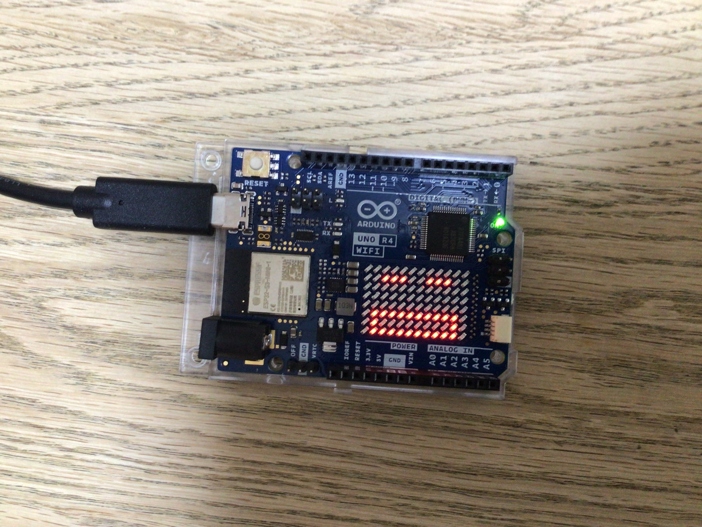
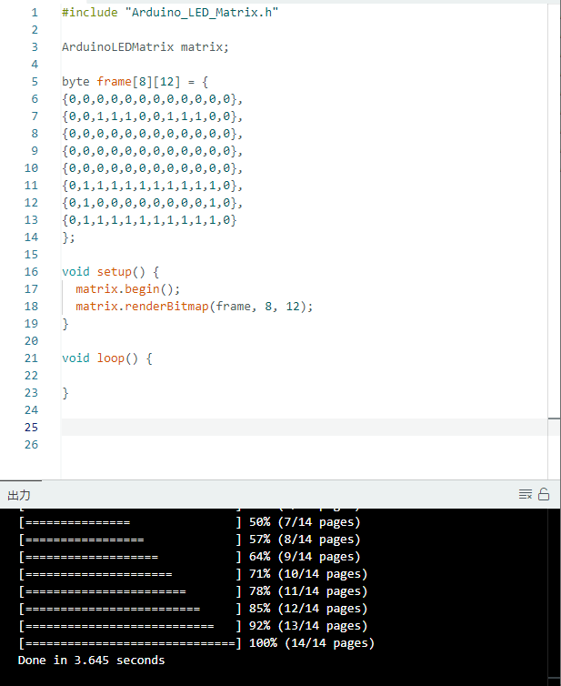

# Arduino

## 顔のコード



```
#include "Arduino_LED_Matrix.h"

ArduinoLEDMatrix matrix;

byte frame[8][12] = {
{0,0,0,0,0,0,0,0,0,0,0,0},
{0,0,1,1,1,0,0,1,1,1,0,0},
{0,0,0,0,0,0,0,0,0,0,0,0},
{0,0,0,0,0,0,0,0,0,0,0,0},
{0,0,0,0,0,0,0,0,0,0,0,0},
{0,1,1,1,1,1,1,1,1,1,1,0},
{0,1,0,0,0,0,0,0,0,0,1,0},
{0,1,1,1,1,1,1,1,1,1,1,0}
};

void setup() {
  matrix.begin();
  matrix.renderBitmap(frame, 8, 12);
}

void loop() {

}

```



[⇦ホームへ戻る](README.md)